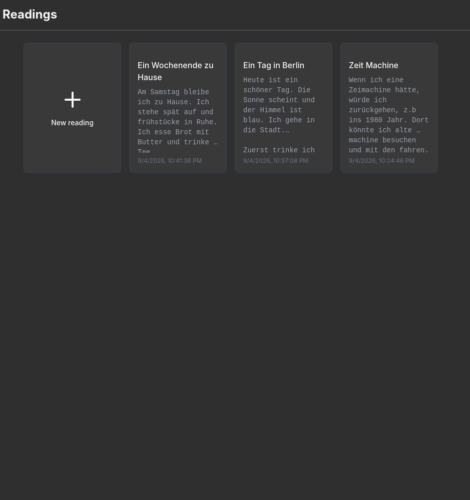
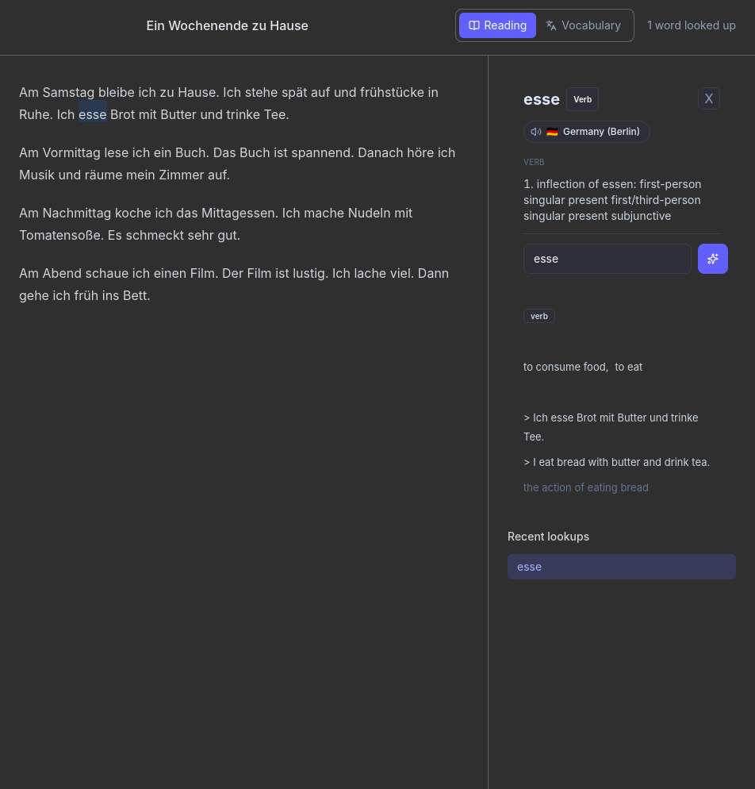
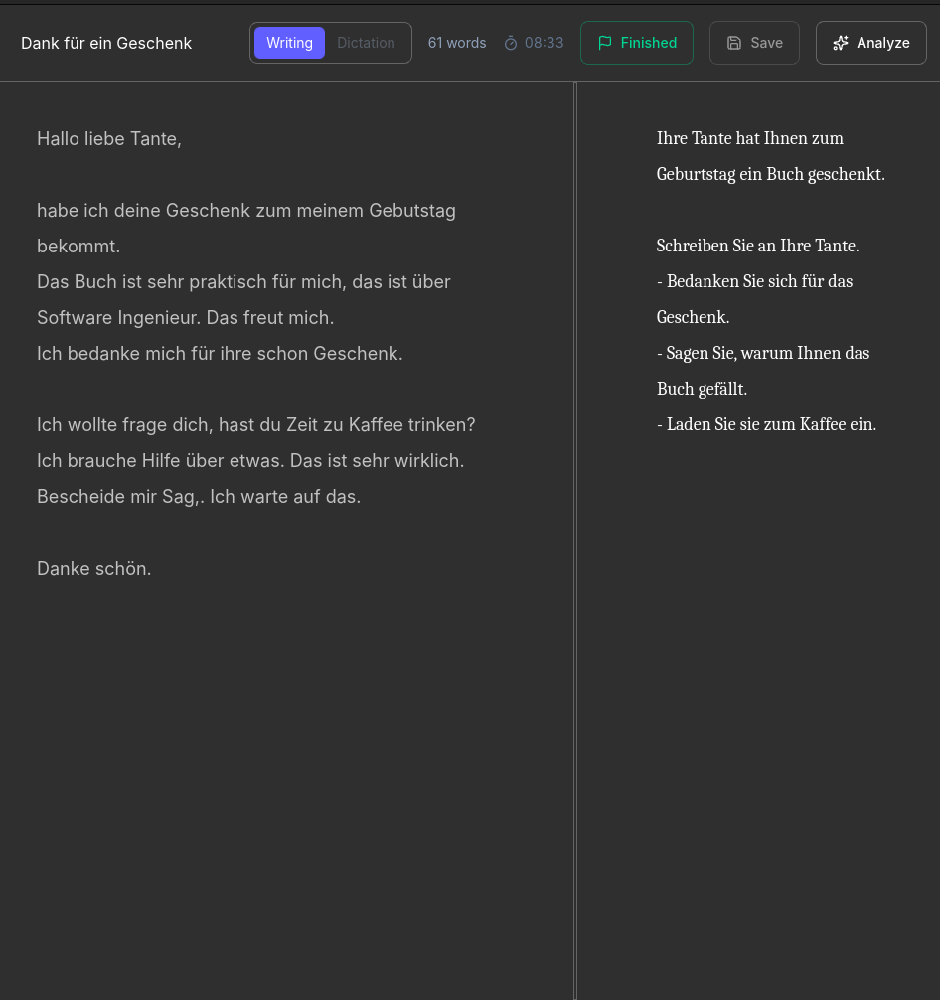
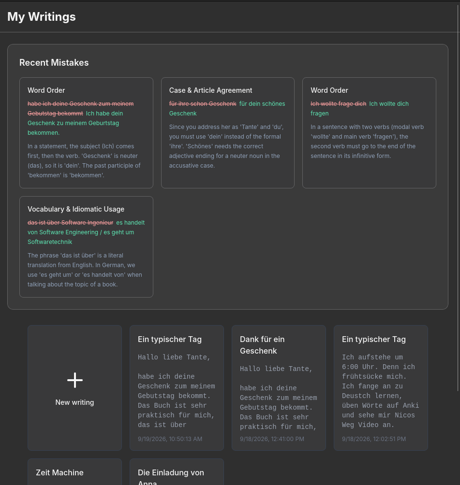
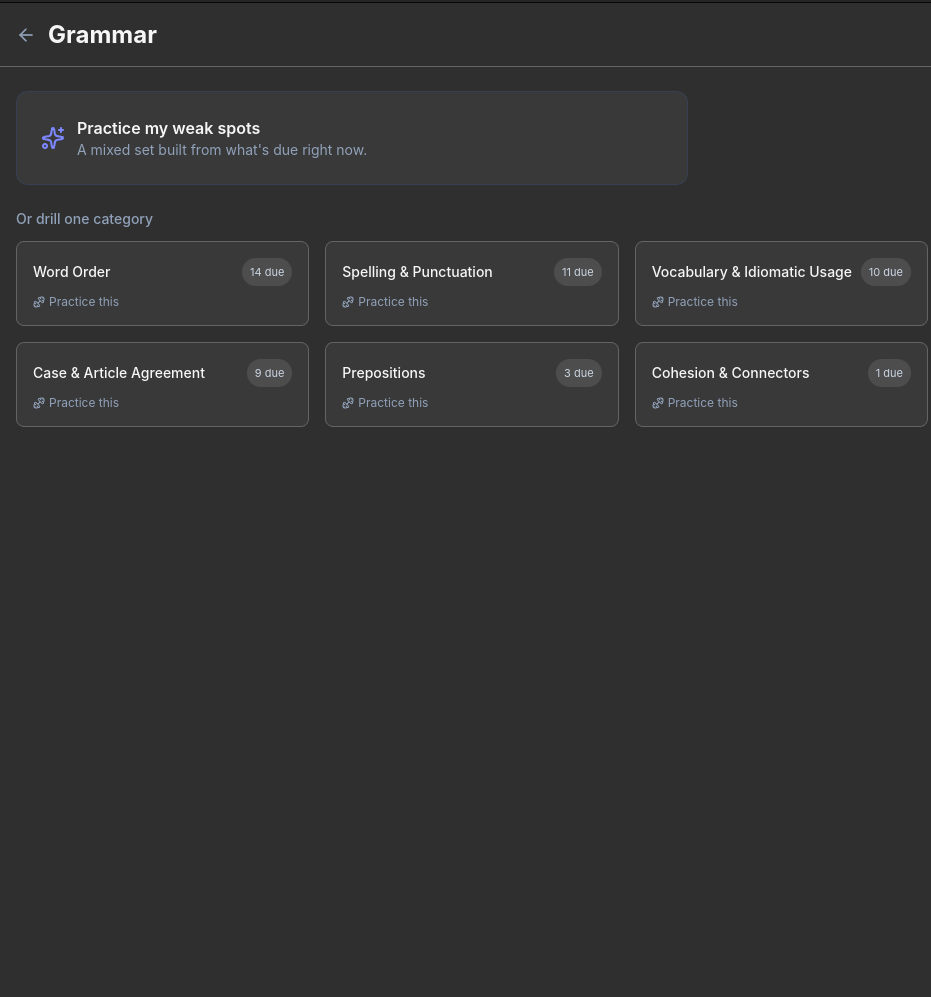
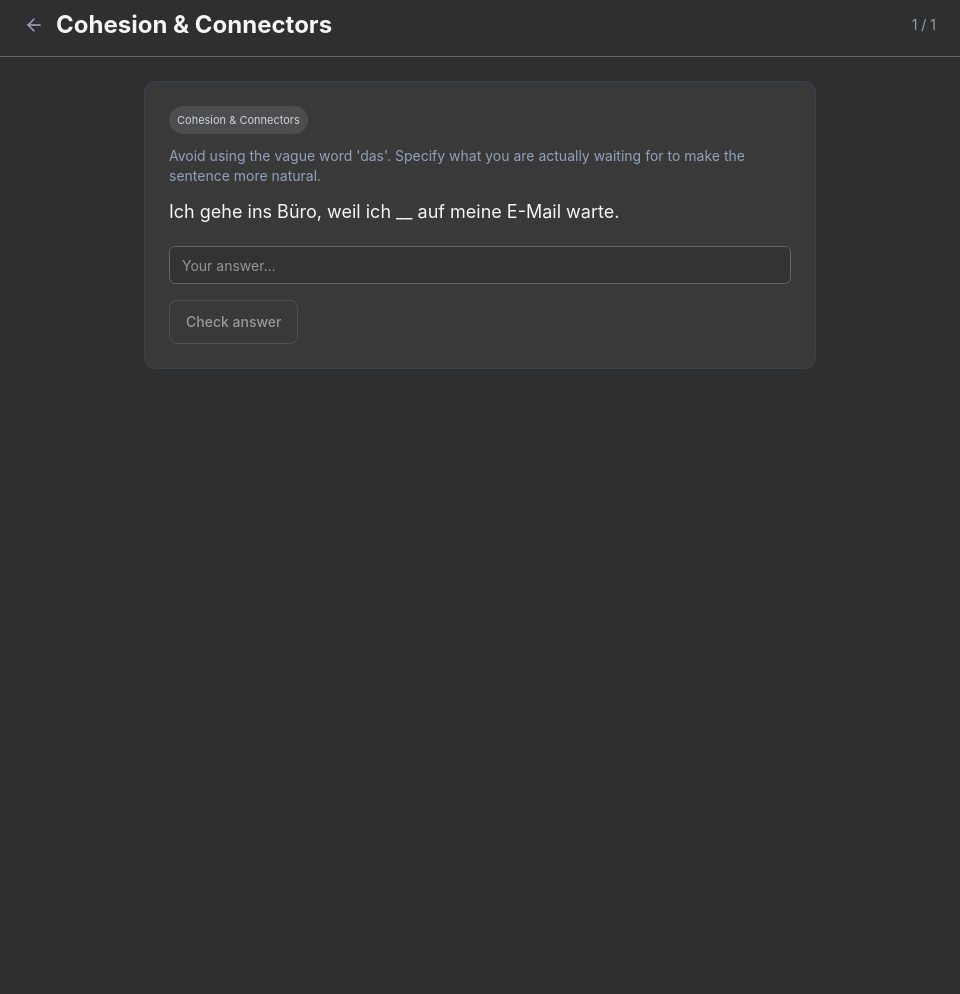
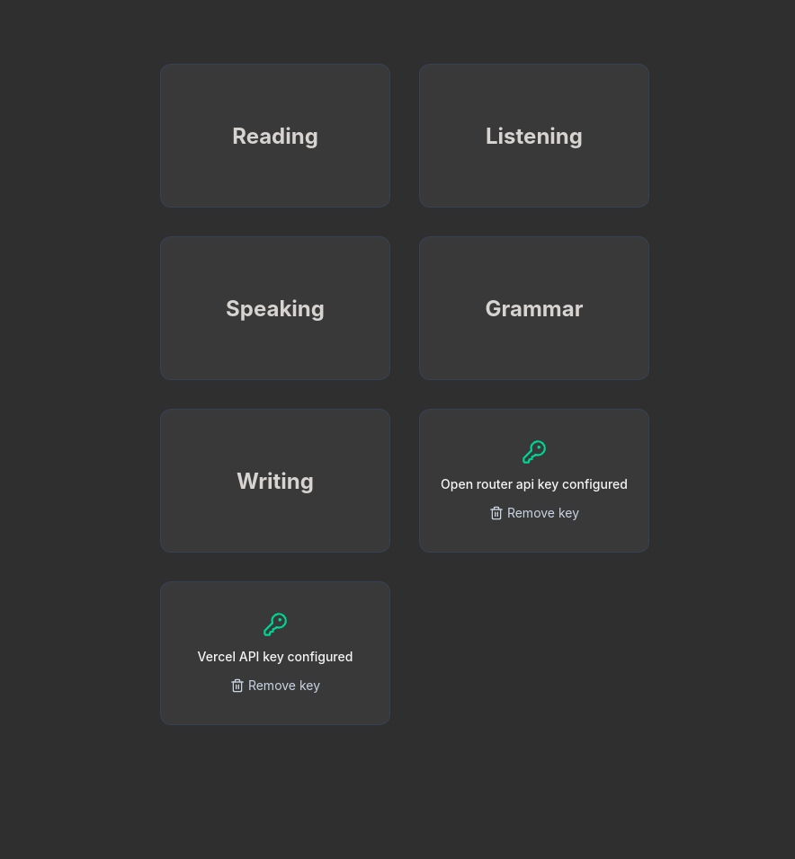

# Environment 🇩🇪

Something tha I needed for learning German :) 

It runs natively on your machine and keeps everything — your texts, your essays, your mistakes — in a local database. No account, no cloud sync. The only network calls it makes are to an LLM (via [OpenRouter](https://openrouter.ai/) or the [Vercel AI Gateway](https://vercel.com/docs/ai-gateway)) for the AI-powered bits, and to Wiktionary for dictionary lookups.

I'm building this for my own daily use, so it's opinionated and still rough around the edges in places. Sharing it in case it's useful to someone else learning German too.

## What it actually does

### 📖 Reading

Paste in any German text — an article, a story, whatever you're reading — and it's saved to your personal library.



Open one up and double-click any word to look it up. This isn't an AI guess — it pulls real definitions, gender/plural forms, verb conjugations, and pronunciation audio straight from Wiktionary. If you want more than the dictionary definition, there's a separate "Explain with AI" option that explains what the word means *in that specific sentence*, with fresh examples.



### ✍️ Writing
image.png
Create a topic (or write freely), and get a proper split-pane editor — your essay on one side, the prompt on the other — with a running timer so you know how long you actually spent.



Hit "Analyze" and an LLM reads your essay like a strict-but-fair teacher: it scores you on grammar, vocabulary, and structure, marks up your original text inline (strikethrough + correction, hover for the explanation), and rewrites the whole thing as a polished version so you can see what "good" looks like.

Every writing library also surfaces your **recent mistakes** at a glance, so patterns jump out instead of getting buried in feedback you'll forget by next week.



### 🧠 Grammar (the part I actually built this whole app for)

This is the reason the app exists. Every mistake the AI catches in your writing doesn't just sit in a feedback panel — it gets tracked, categorized (word order, case agreement, prepositions, etc.), and scheduled for review using spaced repetition, Anki-style.



When something's due, you drill it — but not with the same sentence you got wrong before. The AI generates *fresh* exercises targeting that specific weakness, grades your free-text answers automatically, and reschedules the next review based on how well you knew it.



In other words: your own writing mistakes become your flashcards.

### 🏠 Everything starts here

One screen, five skills, and a place to drop in your API keys (stored securely on-device, never anywhere else).



### 🎧 🗣️ Listening & Speaking

Not built yet. They're on the home screen as a reminder of where this is headed, but there's no functionality behind them today.

## Getting started

You'll need [Rust](https://www.rust-lang.org/tools/install), [Node.js](https://nodejs.org/), and [pnpm](https://pnpm.io/).

```bash
pnpm install
pnpm tauri dev
```

To build a release binary:

```bash
pnpm tauri build
```

You'll need an [OpenRouter](https://openrouter.ai/) API key (and optionally a Vercel AI Gateway key) for the AI features — the app will prompt you for these on first run and store them securely on your device.

## Tech stack

- **Frontend:** React 19, React Router, Tailwind CSS
- **Backend:** Rust via Tauri 2
- **AI:** OpenRouter / Vercel AI Gateway (bring your own key)
- **Dictionary data:** Wiktionary & Wikimedia Commons (for pronunciation audio)

## Status

Actively used and actively changing. Reading, Writing, and Grammar are real and working; Listening and Speaking are placeholders for now.
